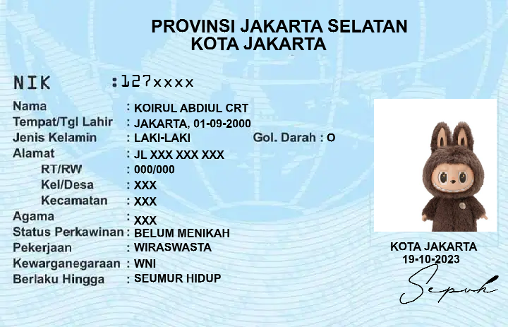

# E-KTP Fake Generator v1.0

**Simulated Indonesian ID Card Generator for Educational & Development Purposes**

E-KTP Fake Generator is a Node.js CLI tool that generates a high-resolution image of an Indonesian ID card (KTP) using custom data and user-defined photos. Built for educational use, image manipulation experiments, and beginner projects in Node.js graphics processing.

---

## Features

- Interactive CLI-based data input
- Dynamic photo integration (default or custom path)
- Accurate positioning using canvas rendering
- OCR-like font simulation for realistic output
- Outputs high-quality PNG files to your device

---

## Preview

> Below is a simulated preview of the generated ID:



---

## Installation

1. **Install packages**

```nodejs
pkg update
pkg upgrade
pkg install git -y
pkg install nodejs -y
pkg install yarn -y
```

2. **How Running**

```nodejs
git clone https://github.com/REYHAN6610/ktp-generator-fake
cd ktp-generator-fake
yarn install
npm start
```
`
